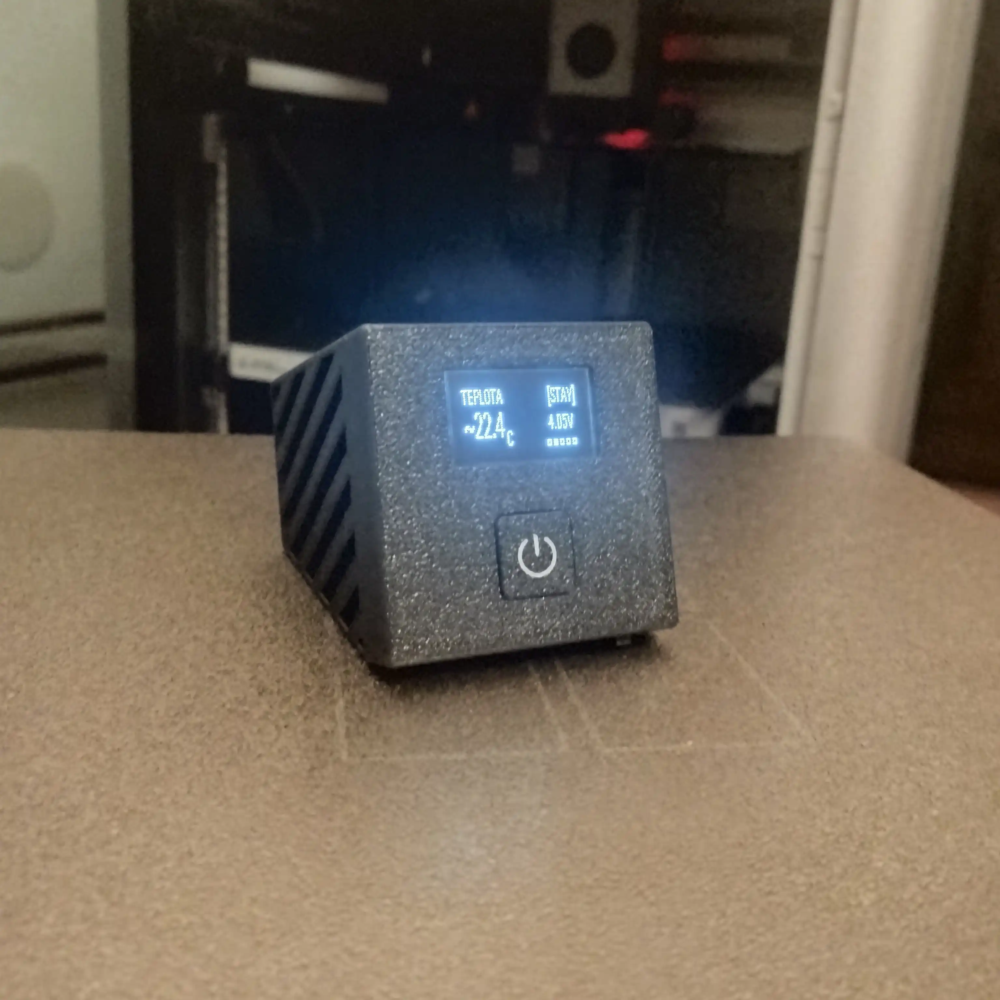

# ESP32-C3 Air Quality Monitor

Bateriový monitor kvality vzduchu postavený na Seeed XIAO ESP32-C3, běžící na [ESPHome](https://esphome.io/) a integrovaný do Home Assistant. Měří CO₂, teplotu, vlhkost a tlak, s malým OLED displejem pro stav a tlačítkem pro probuzení / trvalé zapnutí.

<p align="center">
  
</p>


## Funkce

- CO₂, teplota a vlhkost přes Sensirion SCD41
- Sekundární teplota + barometrický tlak přes BMP180
- 128x32 I2C OLED displej, střídá 5 stránek po 3s
- Ovládání tlačítkem: jedno kliknutí probudí displej na 30s, dvojklik přepíná trvalý režim "stay on", drž 5s+ otevře nastavovací menu
- **Nastavovací menu s presety pro dva způsoby použití** (viz [Menu a presety](#menu-a-presety) níže): **DOMA** (na stole, trvale připojeno do HA) a **CESTA** (bez WiFi, hluboký spánek mezi měřeními, lokální CO₂ alarm na displeji)
- **Hluboký spánek** mezi měřeními pro úsporu baterie na cestách, s nastavitelným intervalem (5/10/15/30/60 min) a poslední naměřenou hodnotou uloženou ve flash, takže displej po probuzení/zapnutí hned ukazuje správná čísla, ne "--" nebo staré nesmysly. Při probuzení časovačem **displej zůstává zhasnutý** - zařízení se jen probudí, změří, odešle a jde zase spát. Rozsvítí se jen po stisku tlačítka nebo po zapnutí vypínačem.
- **Lokální CO₂ alarm** - když je zařízení bez HA (např. v autě přes noc) a CO₂ přesáhne bezpečný práh, displej se sám rozsvítí a bliká s varováním
- Sledování napětí/procenta baterky přes odporový dělič, s 30x přeexponovaným (oversampled) čtením ADC pro potlačení šumu
- Detekce nabíjení z pomalého klouzavého trendu napětí baterky (odolná vůči krátkodobé WiFi zátěži), entity `Charging` a `Charging Duration`
- Automatické vypnutí displeje kvůli úspoře baterky
- WiFi záložní AP + captive portal, pokud je nakonfigurovaná síť nedostupná

## Hardware / BOM

| Součástka | Poznámka |
|---|---|
| Seeed XIAO ESP32-C3 | Hlavní MCU |
| Sensirion SCD41 | CO₂ / teplota / vlhkost, I2C adresa `0x62` |
| BMP180 | Teplota / tlak, I2C adresa `0x77` |
| SSD1306 128x32 OLED | I2C adresa `0x3C` |
| LiPo baterie ~500mAh | Napájí zařízení. Recyklovaná z jednorázové vapy, viz sekce Baterie níže |
| TP4056 nabíjecí/ochranný modul (s DW01A + FS8205A) | Mezi XIAO BAT+/BAT- a baterkou, viz sekce Baterie níže |
| Externí flat/nálepková WiFi anténa (u.FL) | Nahrazuje vestavěnou PCB anténu na desce, na kabelu, viz [ASSEMBLY.md](ASSEMBLY.md) |
| Tlačítko | Připojeno na GPIO3 |
| Rezistory 220kΩ + 100kΩ | Dělič napětí baterky (BAT+ → GPIO4 → GND) |
| Rezistory 4.7kΩ x2 | Externí I2C pull-upy na SDA a SCL |
| Hlavní vypínač (v2) | V sérii mezi baterkou a TP4056 modulem - úplné odpojení napájení, viz [WIRING.md](WIRING.md) |
| 3D tištěný kryt (PETG), v2 | Viz [`enclosure/README.md`](enclosure/README.md), postup sestavení v [ASSEMBLY.md](ASSEMBLY.md) |
| Tlačná pružinka 0.4 × 5.10 mm | Pod tlačítko v předním krytu, přestřižená v půlce - viz [ASSEMBLY.md](ASSEMBLY.md) |

## Zapojení

Kompletní GPIO pinout a schéma zapojení viz [WIRING.md](WIRING.md).

## Firmware

Kompletní ESPHome konfigurace je v [`air-quality-monitor.yaml`](air-quality-monitor.yaml). Před nahráním zkopíruj `secrets.yaml.example` do `secrets.yaml` a doplň vlastní WiFi údaje, API encryption klíč a OTA heslo.

```yaml
wifi_ssid: "your-ssid"
wifi_password: "your-password"
api_encryption_key: "base64-key"
ota_password: "your-ota-password"
fallback_ap_password: "your-fallback-password"
```

**Nadmořská výška:** v `air-quality-monitor.yaml` je u SCD41 nastavené `altitude_compensation: 435m`. Tohle je výchozí hodnota nastavená podle mojí konkrétní lokace, ovlivňuje přesnost přepočtu CO₂. Pokud si tenhle config používáš jinde, uprav si tu hodnotu na nadmořskou výšku svýho místa.

## Menu a presety

Podrž tlačítko 5s+ pro vstup do nastavovacího menu. Uvnitř menu:
- **Jedno kliknutí** - další položka (cyklicky)
- **Dvojklik** - odejít z menu beze změny (co už bylo potvrzeno 5s-holdem, zůstává uložené)
- **Drž 5s+** - potvrdit/přepnout aktuální položku

| Položka | Co dělá |
|---|---|
| REZIM | Aplikuje celý preset (DOMA/CESTA) najednou - viz tabulka níže. Pokud se aktuální nastavení neshoduje s žádným presetem (protože jsi něco upravil ručně), zobrazí se CUSTOM. |
| HA PRIPOJENI | Ruční přepínač WiFi/HA připojení. |
| INTERVAL SPANKU | Cykluje presety [5, 10, 15, 30, 60] minut - jak dlouho spí hluboký spánek. |
| DEEP SLEEP | Když zapnuto, JAKÉKOLIV zhasnutí displeje (30s timeout i ruční klik) rovnou uspí celé zařízení místo pouhého zhasnutí. |
| CO2 ALARM | Zapíná/vypíná lokální varování na displeji při vysokém CO2 (viz níže). |
| ASC KALIBRACE | Zapíná/vypíná automatickou self-kalibraci SCD41 (viz Known Issues níže) - **projeví se až po dalším rebootu/probuzení**, ne okamžitě. Součást presetů DOMA/CESTA (viz tabulka níže), ale jde přepnout i ručně zvlášť. |

| Preset | HA PRIPOJENI | DEEP SLEEP | INTERVAL SPANKU | CO2 ALARM | ASC KALIBRACE |
|---|---|---|---|---|---|
| **DOMA** | zapnuto | vypnuto | - | vypnuto | zapnuto |
| **CESTA** | vypnuto | zapnuto | 10 min | zapnuto | vypnuto |

**CO2 ALARM** je pro situace bez HA (typicky CESTA - např. v autě přes noc): pokud CO2 překročí bezpečný práh (aktuálně 3000ppm spuštění / 2700ppm zhasnutí, hystereze proti blikání), displej se sám rozsvítí a bliká s varováním, i kdyby byl předtím zhasnutý/zařízení v hlubokém spánku. Automatické zhasnutí/uspání se dočasně zablokuje, dokud hodnota neklesne zpátky pod práh - manuální klik tlačítka vždy funguje jako potvrzení/odložení.

Alarm se po každém zapnutí/probuzení **neaktivuje hned** - hodnoty po startu můžou být divoké a nemá z nich spouštět planý poplach. Podrobně (včetně toho, proč SCD41 měří po 5s a ne po 60s) viz [Zahřívání po zapnutí](#zahřívání-po-zapnutí) níže.

## Kryt

3D tištěný z **Aurapol PETG** (v1 byl z PLA), tištěno na Bambu Lab X1C s AMS. Zdrojový soubor a tisková nastavení: [`enclosure/README.md`](enclosure/README.md). Postup sestavení viz [ASSEMBLY.md](ASSEMBLY.md).

Ve v2 mají oba teplotní senzory **vlastní kompartment ve spodku krabičky**, oddělený přepážkou od baterky, TP4056 modulu i ESP32 - tedy od všeho, co uvnitř topí. Kompartment se po nalepení senzorů zatavuje záklopkou. Tlačítko má nově **symbol napájení** a natavuje se přímo na přední kryt.

Vícebarevný je jediný díl (přední tlačítko). Kdo nemá AMS, vytiskne ho jednobarevně - ikonka pak zůstane jako reliéf.

## Baterie

Baterie se nenabíjí přímo přes vestavěný nabíjecí obvod XIAO. Mezi XIAO a baterkou je zapojený externí **TP4056 modul**: XIAO BAT+ a BAT- jdou do OUT+ a OUT- na TP4056, a B+ a B- na TP4056 jdou do samotné baterky. TP4056 tak dělá nabíjení místo XIAO desky.

Deska má kromě hlavního TP4056 čipu i DW01A a FS8205A, takže jde o variantu **s ochranou**, ne jen o holou nabíječku. To řeší ochranu proti přebití, podvybití a zkratu. **Empiricky ověřeno (srpen 2026):** při vybití baterky přibližně pod ~2.5V ochrana skutečně sepne a odpojí napájení - v tu chvíli spadne celé zařízení (ESP32 ztratí napájení, protože jde přes stejnou OUT+/OUT- cestu jako dělič napětí baterky - viz [WIRING.md](WIRING.md)). Zařízení se prostě přestane hlásit do HA (offline), nezasílá žádnou špatnou/plovoucí hodnotu - ADC/ESP32 v tu chvíli neběží vůbec.

Za normálního provozu (mimo zásah ochrany) tohle umístění děliče na přesnost ani na detekci nabíjení nemá prakticky žádný vliv - ochranný FET má v sepnutém stavu odpor jen v řádu desítek miliohmů.

Než na to spolehneš dlouhodobě, stojí za to ověřit:
- **Napětí naprázdno a pod zátěží** multimetrem, ať vidíš, jestli se chová jako zdravý článek (viz Known Issues níže pro kalibraci čtení)
- **Fyzický stav článku** (nabobtnání, poškození obalu) před zabudováním do krytu
- **Přítomnost/nepřítomnost ochranného obvodu** - pokud článek nemá vlastní BMS/protection PCB, spoléháš čistě na nabíjecí obvod na XIAO desce

## Zahřívání po zapnutí

Po zapnutí (hlavní vypínač baterky) nejsou hodnoty hned přesné. Z reálných záznamů ([`data/`](data/README.md)) je vidět, že jsou to **dvě fáze, které spolu nesouvisí**:

| Fáze | Co se děje |
|---|---|
| **0-3 min** | **Chyba samotného SCD41**, ne teplota. Hlásí o ~2 °C víc, vlhkost o ~10-14 % míň. Prokázáno na reálných datech - viz Known Issues. Firmware tahle čtení **zahazuje úplně**, do HA se nedostanou. |
| **3-45 min** | Teprve tady se zahřívá krabička. Teplotní offset platí jen v tepelné rovnováze, takže dokud se box neprohřeje, je hodnota systematicky nízko, i když vypadá stabilně. Datasheet proto žádné číslo nedává, jen říká "in thermal equilibrium". |

Kolik chyby zbývá v které minutě (měřeno na BMP180, který se ustálí kolem 24.15 °C):

| čas | 10 min | 20 min | 30 min | 40 min | 50 min |
|---|---|---|---|---|---|
| chyba | −1.11 °C | −0.58 °C | −0.34 °C | −0.18 °C | −0.06 °C |

Časová konstanta je 13-15 min, ustálení tedy trvá zhruba 3τ.

Firmware to řeší dvěma způsoby:

- **CO₂ alarm se neaktivuje, dokud se hodnoty neuklidní.** Místo pevného čekání sleduje samotná čtení: povolí se, až když jsou 3 čtení po sobě v rozsahu do 150 ppm. Pojistka - pokud se hodnoty neuklidní vůbec, alarm se povolí po 3 minutách tak jako tak (radši hlídat s nejistotou než nehlídat). Jednou povolený se už nevypíná - reálný rychlý nárůst CO₂ v autě by rozptyl překročil a alarm by zmizel přesně ve chvíli, kdy je potřeba.

  SCD41 kvůli tomu měří **po 5s** místo výchozích 60s. Není to kvůli "čerstvějším datům": 5s je vlastní interní vzorkovací rychlost SCD41, takže to nestojí víc energie senzoru, a v režimu CESTA je zařízení vzhůru jen 30s - při pomalejším čtení by na posouzení stability (natož na samotné spuštění alarmu) prostě nezbyl prostor.
- **Prvních 5 čtení SCD41 se zahodí.** Teplota a vlhkost ze SCD41 se první 3 minuty po každém bootu vůbec nepublikují ani neukládají do cache. Není to opatrnost - je to oprava reálného problému, kdy si HA po vybití baterky uložilo jako poslední teplotu hodnotu, která nikdy nebyla naměřená (viz Known Issues).
- **Vlnovka.** `~` před hodnotou (`~25.1 C`) znamená jednu jedinou věc: **tohle není čerstvé, důvěryhodné čtení**. Objeví se ve třech případech - prvních **45 min po studeném startu** (zahřívá se krabička), **po celou dobu nabíjení** (to je ve skutečnosti ten největší vliv, až +3.7 °C - viz Known Issues), a když se hodnota musela vzít z **uložené cache**, protože živé čtení není k dispozici. **Čtvrtý případ přibyl v srpnu 2026: okno chladnutí.** Když se do uspávaného režimu přepne rozběhnutá (a tedy nahřátá) krabička, trvá **~2.5 h**, než se ustálí na okolní teplotě - a po tu dobu je hodnota označená. Když se přepne krabička, co se ohřát nestihla (zapneš ji vypínačem a hned přepneš preset), vlnovka se neukáže vůbec.
- **Teplota se v režimu s deep sleepem bere z BMP180.** Hlavní stránka TEPLOTA zkusí popořadě SCD41 → BMP180 → cache a vezme první, co má živou hodnotu. V normálním provozu to je SCD41; jakmile se ale zapne uspávání, jeho čtení se zahazují (viz Known Issues) a stránka automaticky ukáže BMP180, který startovní skok nemá. Není v tom žádné větvení podle režimu - prostě se použije nejlepší dostupný zdroj, takže to funguje i v prvních 3 minutách běžného zapnutí. **Vlhkost druhý zdroj nemá** (BMP180 ji neměří), takže v režimu s uspáváním ukazuje cache a je označená vlnovkou. To je poctivá odpověď: za 30 s vzhůru se platná vlhkost změřit nedá.

**Po probuzení z deep sleepu se vlnovka nezobrazí, pokud krabička nechladne** - a to je záměr celý. Že se krabička nemusí znovu zahřívat, platí: ve spánku se ustálí na okolní teplotě, a od srpna 2026 se jí tam už neodečítá klidový offset, který tam nepatří (viz Known Issues). Chladnutí po přepnutí z nepřetržitého provozu do spánku pokrývá to okno 2.5 h výš. Označené tedy zůstává jen to, co opravdu důvěryhodné není.

> Těch 45 min je změřené, ne odhadnuté. Předchozí hodnota 20 min pocházela z extrapolace záznamu, který se ukázal být teplý restart - fitovat exponenciálu na krátký, skoro ustálený ocas dalo časovou konstantu necelou polovinu skutečné, a odhad tím pádem přestřelil o víc než dvojnásobek.

## Přesnost

Kolik se tomu dá věřit. Rozlišuj dvě různé věci - **krátkodobou stabilitu** (o kolik se hodnota změnila) a **absolutní přesnost** (jestli je to opravdu tolik). Ta první je o řád lepší.

| Veličina | Krátkodobě (změřeno) | Absolutně | Co to omezuje |
|---|---|---|---|
| **Teplota** | ±0.05 °C | **±0.5 °C** | referenční teploměr, ne senzor |
| **Vlhkost** | ±0.15 % | **neověřeno** | není čím změřit |
| **CO₂** | ±2 ppm | ±(40 ppm + 5 %), tj. ~±190 ppm při 3000 | katalogový údaj, neověřeno |
| **Tlak** | ±0.07 hPa | **neověřeno** | není čím změřit |
| **Napětí baterky** | ±0.02 V | ověřeno ve **dvou bodech** (4.15 a 3.81 V) | spodek rozsahu neproměřený |
| **Procenta baterky** | - | **jen orientační** | lineární převod, LiPo se tak nechová; horní konec (4.12 V = 100 %) je změřený |

### Tři věci, které je fér říct nahlas

**1. Zařízení nemůže být přesnější než reference, kterou se kalibrovalo.** Offsety jsou nastavené proti staršímu lihovému teploměru s modrou kapalinou, jehož vlastní tolerance je u tohohle typu tak **±1 °C** (a stupnice bývá po celých stupních, takže desetina je odhad mezi ryskami). Ty tři odečty vyšly shodně (23.9), takže *opakovatelnost* odečtu byla dobrá - ale jestli ten teploměr sám neukazuje o půl stupně vedle, se z ničeho nedozvíme. Těch ±0.5 °C je strop daný referencí, ne senzory.

**2. Shoda obou senzorů už není nezávislý důkaz.** Dřív se dalo argumentovat, že SCD41 a BMP180 se shodnou na 0.35 °C, i když mají úplně jiné offsety. Jenže **teď jsou oba kalibrované proti tomu samému teploměru**, takže když je ten vedle o 0.7 °C, jsou vedle oba stejně. Ta shoda je konzistence, ne správnost.

**3. Vlhkost je nejslabší číslo v celém zařízení.** Nikdy se neověřovala - vlhkoměr jako reference není. A veze se na teplotě: SCD41 počítá RH ze své vlastní teploty, takže **chyba 1 °C v teplotě znamená asi 4 procentní body v vlhkosti** (ověřeno na reálných datech přes Magnusův vztah). Poslední překalibrování teploty ji posunulo asi o 4 body nahoru a nemáme jak potvrdit, že správně.

### Kdy je to horší, než říká tabulka

Tyhle stavy firmware **označuje vlnovkou** `~`, takže se nedají splést s normálním provozem:

| Situace | Chyba teploty |
|---|---|
| Při nabíjení z prázdné baterky | až **+3.7 °C** (neopravuje se, viz Known Issues) |
| Při dobíjení z ~64 % | až **+2.35 °C** (tentýž jev, menší proud) |
| Prvních 10 min po studeném startu | **−1.1 °C** |
| Prvních 30 min | −0.34 °C |
| Prvních 45 min | −0.06 °C |
| V režimu s uspáváním | **−0.90 / −0.94 °C** (dva záznamy po opravě; před ní −3.55) |

Ta poslední řádka je od srpna 2026 změřená a **z velké části opravená**. Offsety byly změřené pro nepřetržitý provoz, kde se krabička zahřívá pořád; v uspávaném režimu je zařízení vzhůru 4 % času, takže se odečítalo teplo, které tam není. Firmware ho tam už neodečítá. Změřeno třikrát proti referenčnímu teploměru: **−3.55 °C** před opravou přes noc ([`data/2026-08-23-cesta-baseline/`](data/README.md)) a po ní **−0.90 °C** ([`data/2026-08-23-cesta-po-oprave/`](data/README.md)) a **−0.94 °C** ([`data/2026-08-28-cesta-nabijeni-a-chladnuti/`](data/README.md)) - tedy ne odhad, ale tři měření na tom samém hardwaru. **Zbytek zavřený není**: −0.9 je pořád dvojnásobek deklarované ±0.5 °C. Nově ale víme, že je **reprodukovatelný**, takže další odečty tím samým teploměrem už nic nerozhodnou - rozhodne až druhý teploměr, nebo prohození míst krabičky a teploměru. Podrobně v Known Issues níž.

Pátý stav, který tabulka nemá, protože se neopravuje ale označuje: **krabička přenesená rozběhnutá do uspávaného režimu** chladne ~2.5 h a po tu dobu čte výš (na začátku až +6 °C). Firmware na ni po celé to okno drží vlnovku.

### Co by přesnost zvedlo

- **Lepší teplotní reference** (kalibrovaný teploměr, nebo směs ledu a vody jako pevný bod) - zvedlo by strop z ±0.5 °C
- **Druhý CO₂ metr** vedle - jediný způsob, jak ověřit CO₂ a hlídat drift ASC
- **Multimetr ve 2-3 dalších bodech napětí** (~3.5 a ~3.8 V) - dodělalo by dělič
- **Vybíjecí křivka místo lineárního převodu** - opravilo by procenta baterky

### Pro co to stačí tak jak to je

Pro obě zamýšlená použití ano. Sledování pokoje v HA potřebuje hlavně spolehlivé **změny**, a ty sedí na ±0.05 °C. A pro CO₂ alarm v autě je ±190 ppm při prahu 3000 ppm úplně jedno - rozdíl mezi „vzduch je v pohodě" a „dusíš se" jsou tisíce ppm, ne stovky.

## Naměřená data

Skoro každé konkrétní číslo v tomhle README (i většina konstant ve firmwaru) pochází z reálného měření, ne z odhadu. Syrové exporty z Home Assistant History jsou ve složce [`data/`](data/README.md) i s popisem, za jakých podmínek každý záznam vznikl a co z něj vyšlo - včetně toho, co ještě chybí změřit.

## Known Issues

- **Napětí/procento baterky není přesné.** Čtení teď vychází o pár procent výš než multimetr (~+2.6 % pozorováno zatím). Hodnoty děliče a čtení ADC jsou principiálně správně, ale přesný multiplikátor ještě nebyl pořádně zkalibrovaný napříč celým rozsahem napětí. Ber procenta baterky jako orientační, ne přesný údaj.
- **Riziko driftu CO₂ auto-kalibrace (ASC) - teď vypínatelné v menu (srpen 2026).** `automatic_self_calibration` je na SCD41 defaultně zapnutá. ASC předpokládá, že senzor pravidelně vidí čerstvý venkovní vzduch (~400ppm) a podle toho si upravuje baseline (klouzavé okno v řádu dní - jedna špatně větraná noc v autě sama o sobě baseline výrazně neurve, okno je navržené přesně proti tomuhle). Pokud senzor sedí dlouhodobě v prostoru, co se málokdy pořádně vyvětrá, ASC si může posunout baseline vůči špatné referenci a časem podhodnocovat CO₂. Nová menu položka **ASC KALIBRACE** (viz Menu a presety výš) jde vypnout/zapnout ručně, např. před cestou - **projeví se až po dalším rebootu/probuzení** zařízení, protože ESPHome umí ASC nastavit jen při startu, ne za běhu; přepnutí v menu proto jen uloží preferenci, kterou firmware aplikuje přes raw I2C příkaz (SCD4x `0x2416`) při příštím bootu. Implementováno bez `persist_settings` (SCD41 vlastní NVM) záměrně - firmware si nastavení pamatuje samo (ESP32 flash) a při každém bootu ho podle potřeby znovu vynutí, takže NVM senzoru se zbytečně neopotřebovává opakovaným zápisem.
- **Detekce nabíjení měla vážný bug, teď opravený a ověřený z obou stran (srpen 2026).** Původní debounce fix (proti false-positive z WiFi zátěže) byl nastavený na příliš vysoký práh - v reálném testu se `Charging` nespustilo ani jednou za celý 2.5h nabíjecí cyklus. Opraveno použitím pomalého klouzavého baseline napětí (časová konstanta ~10min) místo trendu z jednoho vzorku, s nižším prahem (0.015V/-0.01V). Ověřeno v praxi při reálném nabíjení, a od té doby i **proti hodinovému záznamu vybíjení** (`data/2026-08-22-doma-baseline/`): `Charging` zůstalo celou dobu vypnuté a simulace algoritmu nad těmi daty dala maximální trend **-0.0003 V** proti prahu +0.015 V, tedy žádné falešné sepnutí ani zdaleka.
- **Při nabíjení je teplota až o 3.7 °C vyšší než realita a firmware to záměrně neopravuje.** Změřeno proti referenčnímu teploměru přes celý nabíjecí cyklus z prázdné baterky ([`data/2026-08-22-charging-from-empty/`](data/README.md)): ve vrcholu CC fáze (~40 min od zapojení) byla krabička **+3.7 °C** nad svým ustáleným stavem, drželo se to ~30 min a pak to během ~1.5 h kleslo zpátky na nulu, jak nabíjecí proud dobíhal. Stejný tvar na obou senzorech, takže se ohřívá celá krabička. **Konstanta to opravit nemůže:** teplo je úměrné nabíjecímu proudu, a ten závisí na tom, jak prázdná baterka byla - z nuly dostaneš hodinu plného proudu, dobití z 90 % skoro nic. Jedno číslo by muselo být vedle až o ±3.7 °C podle situace. Křivka podle času selže stejně - to zkoušela v1 a v terénu přestřelila o ~4 °C. Firmware proto `CHARGE_OFFSET_*` nechává na `0.0`, publikuje `Charging` do HA (kde se dá filtrovat) a na displeji dává během nabíjení před teplotu `~`.

  **Druhý a třetí záznam to potvrdily přímo.** V [`data/2026-08-23-charging-warm/`](data/README.md) se nabíjelo ze 64 % s krabičkou už ustálenou - a vrchol vyšel jen **+2.35 °C** (ve 28 min) proti +3.7 °C z prázdné. Opačný extrém přidal [`data/2026-08-28-cesta-nabijeni-a-chladnuti/`](data/README.md): z baterky dojeté až do vypnutí je vrchol **+4.12 °C**. Celé rozpětí je tedy 1.8 °C podle jediné proměnné - jak plná baterka na začátku byla. Stejná krabička, stejná nabíječka, stejná místnost; celý rozdíl 1.4 °C dělá jen to, jak plná baterka na začátku byla. Argument výš tím přestává být úvahou a stává se změřeným faktem. Vidět je i tvar: **je to hrb, ne schod** - po 28 min teplota sama klesá a v 62. minutě je zpátky na +1.37 °C, pořád se zapojenou nabíječkou.
- ~~`Charging` nepozná konec nabíjení~~ **opraveno (srpen 2026), a pak opraveno znovu.** Ve stejném záznamu sepnulo správně 5 min po zapojení, ale vyplo se až přesně po 3 h - což byl bezpečnostní timeout, ne detekce; skutečné nabíjení skončilo o hodinu dřív. Trendové pravidlo to vidět nemohlo, protože pokles napětí po dobití je jen ~0.0009 V/min a nikdy nepřekročí práh −0.01 V. Přidáno proto druhé pravidlo hledající opačný podpis: **napětí vysoko a přestalo se hýbat.**

  První verze toho pravidla (≥ 4.10 V, změna pod 0.001 V, 5× za sebou) byla ale naladěná **na jediný záznam** a druhý ji shodil. V [`data/2026-08-23-charging-warm/`](data/README.md) (dobíjení ze 64 % s už ustálenou krabičkou) se napětí po dokončení usadilo na **4.083 V**, tedy pod prahem 4.10 - pravidlo **nesepnulo ani jednou** a `Charging` viselo celý záznam. Důvod: obě nabíjení skončila na jiném napětí, 4.120 a 4.083 V, 37 mV od sebe na stejném hardwaru. **Absolutní hladina nic negeneralizuje, generalizuje jen plochost.** `FULL_V` je proto teď jen volná pojistka (4.05 V, aby nabíjení zaseknuté na 3.5 V nešlo splést s hotovým) a rozhoduje tolerance plochosti, zvednutá 0.001 → 0.002 V, protože zdejší plató má kroky až 0.0019 V. Nové prahy sepnou správně na **obou** záznamech (18:19 / +125 min a 01:07 / +48 min) a nesedí na hraně: `FULL_V` kdekoliv mezi 4.00-4.08 i počet potvrzení 4-10 dají shodný výsledek. Kdyby byly na jinou baterku pořád moc těsné, pravidlo prostě nesepne a převezme to 3hodinová pojistka - horší, ne rozbité.

- ~~Plně nabitá baterka ukazovala 90 %~~ **opraveno (srpen 2026).** Procenta se počítala lineárně z 3.0-4.2 V, jenže naměřené plno je 4.083-4.120 V - dobitá baterka tedy hlásila 90-93 % a **100 % nešlo dosáhnout nikdy**, což vypadá jako porucha. Horní konec mapy se proto vzal z měření (4.12 V) místo z katalogu. Otevřené zůstává, jestli článek opravdu končí na 4.12 V, nebo jestli dělič podhodnocuje skutečných 4.2 V o ~2 % - na procenta to ale nemá vliv, protože se teď berou z toho, co ADC reálně hlásí při dobití. Že jde pořád jen o **lineární** převod (a LiPo se tak nechová) platí dál, viz bod o přesnosti děliče výš.
- **SCD41 hlásí první ~2 minuty po startu měření o několik °C víc (potvrzeno, ošetřeno).** Není to zahřívání krabičky, je to chování samotného senzoru. Dokázáno dvěma nezávislými způsoby ze záznamu [`data/2026-08-22-cold-start/`](data/README.md): (a) ze **studeného** startu hlásí SCD41 v 6. vteřině o 2.13 °C **víc** než BMP180, ve 2. minutě je naopak pod ním, a pak se srovnají - studený čip nemůže hlásit vysoko; (b) při **brownout restartu** umírající baterky skočil z 24.04 na **28.42 °C za necelých 38 s**, zatímco BMP180 stál na 23.58 - reálná změna o 4.4 °C při klidném druhém senzoru je nemožná. Za celých 6.5 h záznamu jsou skoky nad 1 °C přesně dva a oba sedí na restart. **Ošetřeno:** teplota a vlhkost SCD41 se první 3 min po bootu zahazují (viz [Zahřívání po zapnutí](#zahřívání-po-zapnutí)).
- **A opakuje se to při KAŽDÉM probuzení z deep sleepu - v CESTA je proto teplota ze SCD41 nepoužitelná.** Ověřeno devíti cykly probuzení ([`data/2026-08-22-cesta-wake-cycles/`](data/README.md)): pokaždé startuje SCD41 **~5.5 °C nad** BMP180 a za 10 s spadne o 0.72-0.76 °C. Rozptyl přes všech devět probuzení je 5.36 až 5.59 °C, tedy naprosto konzistentní. Když přitom zařízení běželo v kuse, rozdíl byl normálních 0.31 °C. Vlhkost jde s tím: 61.8 % za běhu, 46.7-50.6 % při probuzení. BMP180 přitom klesá hladce a **skok nemá vůbec**. Vysvětlení, které sedí na všechna tři měření: první čtení po `start_periodic_measurement` vypadá, jako by na něj ještě nebyl aplikovaný `temperature_offset`, a ten se dotáhne během ~2 min - při studeném startu je čip stejně studený jako krabička, takže chybějící offset dělá jen ~2 °C, kdežto ve spánku čip běží dál a je proti chladnoucí krabičce rozehřátý, takže totéž dělá ~5.5 °C. Prakticky: 30 s vzhůru je řádově míň, než těch 2 min. Firmware ta čtení zahazuje, takže se do HA nedostane nesmysl, a **displej v takovém režimu bere teplotu z BMP180** (viz [Zahřívání po zapnutí](#zahřívání-po-zapnutí)). V Home Assistantu je potřeba na to myslet ručně: entita `Temperature (SCD41)` se v režimu s uspáváním přestane aktualizovat, použij `Temperature (BMP180)`. Vlhkost druhý zdroj nemá a v takovém režimu se změřit nedá.
- **Po vybití baterky zůstane v HA viset hodnota, která nebyla naměřená (opraveno).** Když baterka došla ([`data/2026-08-22-cold-start/`](data/README.md)), zařízení se cestou dolů dvakrát brownout-restartovalo a pokaždé stihlo publikovat transient ze SCD41. Poslední, co HA dostalo a pak na tom zůstalo viset, bylo **27.43 °C** (realita 23.58) a **53.7 %** vlhkosti (předtím 64.96). Navíc to vypadalo jako dvě měření, i když bylo jen jedno: po krátkém výpadku spojení poslalo ESPHome ty samé stavy z RAM znovu a HA je zalogovalo jako změnu, protože entita mezitím byla `unavailable`. Poznat se to dá podle **bit-identických** floatů. Opraveno tím zahazováním prvních 3 minut - transient se do HA vůbec nedostane a poslední zapamatovaná hodnota tak zůstane ta poslední skutečně naměřená.
- ~~V uspávaném režimu je teplota o 3.55 °C pod realitou~~ **z velké části opraveno (srpen 2026).** Předpověď z minula ("stejný offset tam nejspíš odečítá víc, než by měl") seděla, a teď má číslo. Přes noc v uspávaném režimu s intervalem 10 min ([`data/2026-08-23-cesta-baseline/`](data/README.md), 12.4 h) drží BMP180 posledních pět hodin naprosto klidně **18.955 °C ± 0.043**, zatímco referenční teploměr vedle hlásí **22.5 °C**. Publikovaná chyba je tedy **−3.55 °C**; syrové čtení senzoru (tj. +2.46 zpátky) je na 21.415, tedy −1.09 °C.

  **Příčina je jednoznačná.** `REST_OFFSET_BMP180 = 2.46` se odečítá bezpodmínečně, ale změřený byl v **DOMA**, kde zařízení běží nepřetržitě a krabička se od sebe sama trvale hřeje. V uspávaném režimu je vzhůru **26 s ze 626** (4.2 % času) a BMP180 se čte ~3 s po bootu - tedy ve stavu, do kterého se krabička dostala za 10 min spánku, prakticky v rovnováze s okolím. Není tam co odečítat. Totéž se principiálně týká i `temperature_offset: 6.7°C` uvnitř SCD41, jen to není vidět, protože ze SCD41 v tom režimu nepřijde vůbec nic (bod výš).

  **Zbytek proti syrovému čtení otevřený zůstává** - může to být vlastní chyba BMP180 (datasheet ±1 °C), chyba teploměru (±0.5 °C), nebo skutečný rozdíl mezi místem krabičky a místem teploměru. Na novou konstantu to nestačí: klidový offset v DOMA se dělal ze **tří** odečtů po pěti minutách plus dvou kontrol platnosti a stejný protokol chce i tenhle.

  **Oprava:** klidový offset se odečítá jen tehdy, když je `cold_boot` pravdivé, tedy když tenhle boot **není** probuzení ze spánku. Klíčem je fyzická historie, ne nastavení režimu - stejná úvaha, podle jaké si displej vybírá zdroj teploty. Nulu nebylo potřeba měřit, plyne z duty cyklu; kontrola řádu: 2.46 °C při ~34 mA a 4 V dává ~18 K/W, takže ~0.3 mA klidového odběru ve spánku odpovídá ~0.02 °C.

  **Ověřeno na železe** ([`data/2026-08-23-cesta-po-oprave/`](data/README.md), 2.8 h, 16 probuzení): skok je vidět přímo v datech, protože flash boot je ještě `cold_boot` a odečítá - 19.746 °C v 17:40, **22.421 °C při prvním probuzení ze spánku**, tedy +2.676 proti konstantě 2.46 (zbytek je skutečný drift za těch 10 min). Proti referenčnímu teploměru ve třech bodech **−0.90 °C** (sd 0.18) tam, kde ta samá data bez opravy dávají −3.36.

  **Zbytek tím ale opravený není.** Druhý záznam ([`data/2026-08-28-cesta-nabijeni-a-chladnuti/`](data/README.md)) dal **−0.94 °C** se směrodatnou odchylkou 0.02, s krabičkou prokazatelně ustálenou (rozptyl 0.043 °C přes hodinu). Dva nezávislé záznamy, jiný den, jiný stav baterky - zbytková chyba je tedy **reprodukovatelná**, ne šum.

  **A protože je reference pořád ten samý teploměr jako při kalibraci offsetů, dá se z toho dopočítat, co ta konstanta 2.46 doopravdy je.** Nastavená byla jako `raw − teploměr` v režimu DOMA, takže tam zařízení sedí na teploměr *z definice*. V uspávaném režimu se neodečítá a self-heating tam podle duty cyklu není. Odečtením obou vztahů vypadne chyba teploměru i chyba senzoru a zbude **skutečné self-heating 3.40 °C** - číslo nezávislé na tom, jak přesná ta reference je. Konstanta 2.46 tedy nikdy nebyla čisté self-heating, ale **rozdíl** ohřevu 3.40 a vlastní chyby BMP180 −0.94.

  **Praktický důsledek: DOMA čte o 0.94 °C výš než uspávaný režim** ve stejné místnosti. To je fakt o zařízení, ne o teploměru. Který z těch dvou režimů je ten správný, rozhodnuté **není**: když je přesný teploměr, čte BMP180 nízko a správně je DOMA; když je přesný senzor, ukazuje teploměr vysoko a správně je uspávaný režim. Obojí sedí do tolerancí (BMP180 ±1 °C, teploměr ±1 °C) a **dalšími odečty tím samým teploměrem se to rozhodnout nedá** - jeho chyba se z nich nevydělí. Rozhodne druhý referenční teploměr, nebo prohození míst krabičky a teploměru: to musí otočit znaménko.

  Displej tenhle stav označuje: po přepnutí nahřáté krabičky do uspávaného režimu drží vlnovku po dobu okna chladnutí (150 min, viz níž).

- ~~V uspávaném režimu nefunguje žádný filtr, který potřebuje historii~~ **opraveno (srpen 2026).** Deep sleep je **plný reboot**: každé probuzení začíná od nuly a trvá ~26 s. Při `update_interval: 60s` z toho plyne, že BMP180, tlak i `battery_voltage` stihnou za probuzení právě **jedno** čtení - a všechno, co se počítá z několika za sebou, tak nemá z čeho počítat.

  Vidět je to přímo v datech ([`data/2026-08-23-cesta-baseline/`](data/README.md)): ve 14:43:48 publikovalo BMP180 **18.028 °C** mezi sousedy 18.911 a 18.917. Přesně ten typ jednoho špatného I2C čtení, proti kterému byl přidán `median` filtr (okno 3) - a přesto prošel, protože se `send_first_at: 1` vydá medián z jednovzorkového okna, což je ten vzorek sám.

  Stejný mechanismus platil i pro medián ze 3 u `battery_voltage` a hlavně pro **detekci nabíjení**: `batt_v_slow_avg`, `charge_confirm_count`, `full_confirm_count` i `is_charging` byly všechny `restore_value: false`, takže klouzavý průměr s časovou konstantou ~10 min dostal za probuzení jeden vzorek a pak se zahodil - **`Charging` v uspávaném režimu nemohlo sepnout nikdy.**

  **Opraveno třemi různými způsoby, podle toho, co který senzor potřebuje.** U BMP180 a tlaku stačilo **zrychlit polling na 5 s**: za probuzení pak dorazí ~5 čtení, okno mediánu se naplní a filtr funguje uvnitř jednoho bootu, bez jakéhokoliv trvalého stavu. U napětí se historie mediánu **ukládá do flash**, protože ta se stejně potřebuje pro detekci nabíjení. A detekce nabíjení dostala v uspávaném režimu **vlastní, jednodušší pravidlo**: krok napětí proti minulému probuzení. Nabíjení přidá ~+40 mV za deset minut, vybíjení ubere ~1.3 mV, a medián drží šum na 2.16 mV - odstup je tak velký, že to nepotřebuje ani klouzavý průměr, ani potvrzování na sepnutí.

  Vedlejší efekt, který stojí za zmínku: **ve spánku odpadá celý problém s koncem nabíjení.** Heuristika „vysoko a plocho" (`FULL_V`) existuje proto, že klouzavý průměr má mrtvou zónu - konstantní napětí dá trend 0, což je mezi prahy. Krok mrtvou zónu nemá: konstantní napětí dá krok 0, tedy pod uvolňovacím prahem, a příznak spadne sám.

  Nový stav, který musí přežít spánek a **nesmí** přežít vypnutí, je vyřešený flash globály plus vynulováním v `on_boot`, kdykoliv boot není probuzení ze spánku. Bez toho by se `is_charging` po týdnu na polici probudilo jako `true`.

  Prahy nejsou od oka. `data/threshold-sweep.py` pouští pravidlo přes obě nabíjecí sady podvzorkované na 10 min i přes noční záznam jako regresi: práh sepnutí dává **identický výsledek od +12 do +30 mV** a nula falešných sepnutí za 72 probuzení, takže +20 nesedí na hraně; uvolnění `+5 mV` osciluje, `< 0` ne; a ze tří variant počtu potvrzení trefí konec nabíjení na dvě minuty jen trojka.

  **Ověřeno na železe** ([`data/2026-08-23-cesta-po-oprave/`](data/README.md)): šestnáct hodnot BMP180 tvoří monotónně klesající řadu bez jediné výjimky, největší skok mezi probuzeními **−0.092 °C** proti −0.886 před opravou. Rozptyl kroku napětí spadl z **8.02 mV na 1.45** (spec předpovídal 2.16), takže největší pozorovaný kladný krok je +2.45 mV proti prahu +20 - **osminásobná rezerva a nula falešných sepnutí za 11 kroků**. **A že příznak sepne, když se nabíječka opravdu připojí, je od 28. 8. taky ověřené** ([`data/2026-08-28-cesta-nabijeni-a-chladnuti/`](data/README.md)): sepnulo za **13 min**, na prvním probuzení, kde to pravidlo vůbec spočítat mohlo, krokem +43.6 mV. Nejmenší krok za celé nabíjení byl 35 mV, tedy 1.75× nad prahem i na dobíhajícím proudu, a vypnulo 41 min po odpojení. Práh +20 mV je tím ohraničený z obou stran.

- ~~`Battery Level` chybí ve 29 % probuzení~~ **opraveno (srpen 2026).** V nočním záznamu je `unknown` ve **21 ze 72** probuzení. Komentář v kódu přitom tvrdí, že nastat nemá ("the voltage sensor is registered first and runs first on a shared 60s tick") - nastává skoro v třetině případů. Obě šablony mají `update_interval: 60s` a ESPHome plánuje první běh intervalu na `now + náhodný offset v [0, 5 s)` (`Scheduler::calculate_interval_offset_`), a to **nezávisle pro každou komponentu**. Když padne `battery_level` dřív než `battery_voltage`, uplatní se pojistka `if (!id(battery_voltage).has_state()) return {};`, nepublikuje se nic - a protože je zařízení vzhůru jen ~26 s, **druhá šance v tom probuzení nepřijde**. Displej tím netrpí (`cached_battery_pct` je flash-backed), postižená je řada v Home Assistantu. **Opraveno přesně takhle:** procenta se počítají na konci lambdy `battery_voltage` a publikují přes `publish_state()`, šablona `Battery Level` přišla o vlastní tik i o pojistku `has_state()`. Závod tím mizí konstrukcí - napětí je v scope, takže není na co být brzo. **Ověřeno na železe** ([`data/2026-08-23-cesta-po-oprave/`](data/README.md)): **0 `unknown` za 16 probuzení** proti 22 z 64 řádků v nočním záznamu. Že řádků je jen 12, výpadek není - HA zapisuje jen změny a pětkrát se hodnota bit-identicky zopakovala, což je podpis mediánu, který teď opravdu běží.
- **BMP180 občas pustí jedno úplně vedlejší čtení (opraveno, srpen 2026).** V hodinovém záznamu (`data/2026-08-22-doma-baseline/`, 01:56:54Z) spadla teplota na 24.41 °C mezi sousedy ~24.70 °C - a **stejné čtení** zároveň ukázalo tlak 956.41 hPa proti sousedním ~957.05 hPa. Jde tedy o jedno špatné I2C čtení, ne o šum na jednom kanálu. BMP180 do té doby neměl žádný filtr, takže se ta hodnota propsala do HA, na displej i do cache. Přidán `median` filtr (okno 3) na teplotu i tlak, zapojený **před** korekční lambdu, aby se čistila i cachovaná hodnota. Dlouho to ale platilo **jen v nepřetržitém provozu**: v uspávaném režimu začínalo každé probuzení s prázdným oknem, takže v nočním záznamu jeden takový výkyv (−0.886 °C) znovu prošel. Od srpna 2026 čte BMP180 po 5 s místo po 60 s, takže se okno naplní i v ~26s probuzení a filtr funguje v obou režimech.
- **Napětí baterky skákalo nahoru v okamžiku připojení nabíječky - z velké části vyřešeno přepojením v2 (srpen 2026).** Reálný capture (`data/2026-08-21-v1-charger-connect/`) s v1 zapojením (dělič na BAT+/BAT- pinech XIAO, tedy za TP4056 modulem): klidové ~3.72V, hned po zapojení nabíječky skok na ~4.11-4.18V během 1 minuty. Po přepojení horní nohy děliče přímo na B+ baterky (viz [WIRING.md](WIRING.md)) se skok v praxi výrazně zmenšil/zmizel - ukazuje to, že většina toho skoku nebyla čistě vnitřní odpor článku, ale přidaná sériová impedance z trasy/kontaktů TP4056 modulu, kterou nové zapojení obchází. Menší zbytkový skok (čistě z vnitřního odporu článku samotného) je pořád fyzikálně očekávatelný, hlavně u recyklovaného/staršího článku - to není bug.
- **Jednorázové šumové výkyvy v `Battery Voltage` (opraveno, srpen 2026).** Stejný capture ukázal jedno čtení (celá 60s perioda) o ~0.13V níž než sousední - pravděpodobně krátký pokles napájení při WiFi vysílání zasáhl celou dávku 30 oversamplovaných čtení najednou (ta běží v řádu ms po sobě, takže je šum tohohle typu "přeskočí" všechny stejně - oversampling proti němu nepomůže). Medián z posledních 3 čtení se počítá **přímo v lambdě** `battery_voltage` ([`packages/sensors.yaml`](packages/sensors.yaml)), ne jako externí `median` filtr - externí filtr by čistil jen publikovanou hodnotu, zatímco detekce nabíjení by dál viděla syrová čtení (přesně ten bug popsaný o řádek výš). **Potvrzeno funkční** z hodinového záznamu (`data/2026-08-22-doma-baseline/`): ze 64 očekávaných čtení je v HA jen 42 změn, tj. 22× byla publikovaná hodnota bit-identická s předchozí - což je přesně podpis mediánu (znovu vydá dřívější vzorek). U syrového ADC šumu by se float hodnoty takhle neopakovaly. Zbytkový šum je ~0.018 V (≈1.5 % baterky).
- **Dělič sedí ve dvou bodech, 4.15 a 3.81 V (druhý změřený 28. 8. 2026).** Nahoře hlásily HA i multimetr shodně 4.15 V; teď při vybité půlce ukazuje HA **3.81 V** a multimetr **3.81-3.82 V**, tedy shoda v mezích odečtu. Násobič `* 3.2` je tím ověřený přes rozsah 3.81-4.15 V, ne jen v jednom bodě.

  **Tím padá i podezření, že dělič podhodnocuje o ~2 %.** Dvouprocentní chyba by při 3.81 V dělala 76 mV a při 4.15 V 83 mV - obojí by bylo na multimetru vidět na první pohled. Není. **Plná baterka tedy opravdu končí kolem 4.12 V**, není to podhodnocených 4.2 V; horní konec mapy procent je nastavený správně. Starší pozorování o ~+2.6 % odchylce je tím ve dvou bodech vyvrácené a nejspíš pocházelo z jiných podmínek.

  **Neproměřený zůstává spodek rozsahu** (~3.5 V a níž). Právě tam by se případná nelinearita ADC projevila nejvíc, a je to zároveň oblast, kde na napětí závisí varování před vybitím.
- **SCD41 běžel i během hlubokého spánku a žral víc než všechno ostatní dohromady (opraveno, srpen 2026).** Senzor není na napájecí větvi ESP32 - 3V3 jde i ve spánku, takže dál měřil po 5 s, i když ho nikdo neposlouchal. Datasheet dává 243 mJ na jedno měření, což při 5s intervalu vychází na **~14.7 mA trvale** proti **0.15 mA** v klidovém režimu - zhruba stokrát víc, a řádově víc než spící ESP32. V datech to je vidět: při 5min intervalu a 30 s vzhůru (desetina času pod proudem) se baterka vybíjela jen o ~15 % pomaleji než při nepřetržitém běhu (−0.070 V/h proti −0.082 až −0.089 V/h). Zpětný výpočet z hodnoty pro nepřetržitý běh dá ~34 mA celkem, což odpovídá ESP s WiFi plus přesně tenhle senzor. Nezávislé potvrzení, že opravdu běžel: teplotní skok při probuzení je ~5.5 °C, mnohem větší než ~2 °C při studeném startu - a takhle rozehřátý být čip nemůže, pokud neměří. **Opraveno** posláním `stop_periodic_measurement` před uspáním, v obou cestách do deep sleepu. Odhad byl 3-4×; **změřeno vyšlo zhruba 9×** - noční záznam ([`data/2026-08-23-cesta-baseline/`](data/README.md), 12.4 h, interval 10 min) dává **−0.0076 V/h** proti −0.070 V/h z `2026-08-22-cesta-wake-cycles/`. Tři výhrady, aby se to číslo nepřecenilo: mezi těmi dvěma záznamy se **zároveň** změnil interval (5 → 10 min, tedy poloviční duty cycle), měřilo se v **jiné části vybíjecí křivky** (V/h se přes ni nedá porovnávat) a starší záznam nezačínal od plné baterky. A **CO2 se po zaparkování spolehlivě rozjede zpátky** - ověřeno ve všech 72 probuzeních té noci, pokaždé ~5 čtení.
- **Rychlé vybíjení v režimu DOMA.** V testu (srpen 2026, ještě na v1 firmwaru bez deep sleepu) baterka klesla ze 4.15V na 2.71V za ~10 hodin běžného provozu. Hodinový v2 záznam v režimu DOMA (`data/2026-08-22-doma-baseline/`) to potvrzuje: **-0.08 V/h** při zapnuté WiFi a vypnutém displeji. Na to je právě preset **CESTA** (deep sleep), a ten je teď taky změřený: přes noc ([`data/2026-08-23-cesta-baseline/`](data/README.md), 12.4 h, interval 10 min, plná baterka) vyšlo **−0.0076 V/h**, tedy **38 % rozpočtu** −0.02 V/h, který si CESTA kladla za cíl. Procenta to potvrzují nezávisle: 100 % → 89.9 % za 12.4 h. Lineárně extrapolováno (**jen řádový odhad**, LiPo křivka lineární není a záznam pokrývá jen úsek 4.15-4.00 V) to je z plné baterky ~4.5 dne do 3.3 V. Měřeno navíc se **zapnutou WiFi**, kterou skutečná CESTA vypíná - reálná spotřeba je tedy ještě o kus nižší. V DOMA se s trvalým provozem na baterku počítat nedá. Doporučuje se nastavit v Home Assistantu notifikaci na nízké napětí (např. pod 3.3-3.4V), aby se předešlo opakovanému dojíždění až k ochrannému cutoffu (~2.5V, viz sekce Baterie výše) – to urychluje degradaci článku, obzvlášť u recyklovaného.

## Licence

MIT
