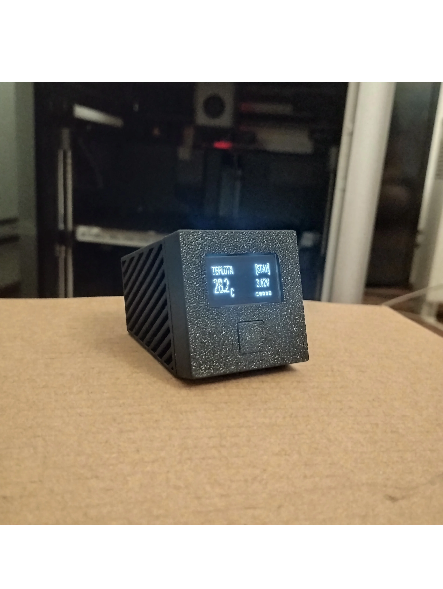

# ESP32-C3 Air Quality Monitor

Bateriový monitor kvality vzduchu postavený na Seeed XIAO ESP32-C3, běžící na [ESPHome](https://esphome.io/) a integrovaný do Home Assistant. Měří CO₂, teplotu, vlhkost a tlak, s malým OLED displejem pro stav a tlačítkem pro probuzení / trvalé zapnutí.

<p align="center">
  
</p>


## Funkce

- CO₂, teplota a vlhkost přes Sensirion SCD41
- Sekundární teplota + barometrický tlak přes BMP180
- 128x32 I2C OLED displej, střídá 5 stránek po 3s
- Ovládání tlačítkem: jedno kliknutí probudí displej na 30s, dvojklik přepíná trvalý režim "stay on", drž 5s+ otevře nastavovací menu
- **Nastavovací menu s presety pro dva způsoby použití** (viz [Menu a presety](#menu-a-presety) níže): **DOMA** (na stole, trvale připojeno do HA) a **CESTA** (bez WiFi, hluboký spánek mezi měřeními, lokální CO₂ alarm na displeji)
- **Hluboký spánek** mezi měřeními pro úsporu baterie na cestách, s nastavitelným intervalem (5/10/15/30/60 min) a poslední naměřenou hodnotou uloženou ve flash, takže displej po probuzení/zapnutí hned ukazuje správná čísla, ne "--" nebo staré nesmysly
- **Lokální CO₂ alarm** - když je zařízení bez HA (např. v autě přes noc) a CO₂ přesáhne bezpečný práh, displej se sám rozsvítí a bliká s varováním
- Sledování napětí/procenta baterky přes odporový dělič, s 30x přeexponovaným (oversampled) čtením ADC pro potlačení šumu
- Detekce nabíjení z pomalého klouzavého trendu napětí baterky (odolná vůči krátkodobé WiFi zátěži), entity `Charging` a `Charging Duration`
- Automatické vypnutí displeje kvůli úspoře baterky
- WiFi záložní AP + captive portal, pokud je nakonfigurovaná síť nedostupná

## Hardware / BOM

| Součástka | Poznámka |
|---|---|
| Seeed XIAO ESP32-C3 | Hlavní MCU |
| Sensirion SCD41 | CO₂ / teplota / vlhkost, I2C adresa `0x62` |
| BMP180 | Teplota / tlak, I2C adresa `0x77` |
| SSD1306 128x32 OLED | I2C adresa `0x3C` |
| LiPo baterie ~500mAh | Napájí zařízení. Recyklovaná z jednorázové vapy, viz sekce Baterie níže |
| TP4056 nabíjecí/ochranný modul (s DW01A + FS8205A) | Mezi XIAO BAT+/BAT- a baterkou, viz sekce Baterie níže |
| Externí flat/nálepková WiFi anténa (u.FL) | Nahrazuje vestavěnou PCB anténu na desce, na kabelu, viz [ASSEMBLY.md](ASSEMBLY.md) |
| Tlačítko | Připojeno na GPIO3 |
| Rezistory 220kΩ + 100kΩ | Dělič napětí baterky (BAT+ → GPIO4 → GND) |
| Rezistory 4.7kΩ x2 | Externí I2C pull-upy na SDA a SCL |
| Hlavní vypínač (v2) | V sérii mezi baterkou a TP4056 modulem - úplné odpojení napájení, viz [WIRING.md](WIRING.md) |
| 3D tištěný kryt (PLA), v2 | Nový kryt, viz [`enclosure/README.md`](enclosure/README.md) - postup sestavení v [ASSEMBLY.md](ASSEMBLY.md) zatím odpovídá starému (v1) krytu |

## Zapojení

Kompletní GPIO pinout a schéma zapojení viz [WIRING.md](WIRING.md).

## Firmware

Kompletní ESPHome konfigurace je v [`air-quality-monitor.yaml`](air-quality-monitor.yaml). Před nahráním zkopíruj `secrets.yaml.example` do `secrets.yaml` a doplň vlastní WiFi údaje, API encryption klíč a OTA heslo.

```yaml
wifi_ssid: "your-ssid"
wifi_password: "your-password"
api_encryption_key: "base64-key"
ota_password: "your-ota-password"
fallback_ap_password: "your-fallback-password"
```

**Nadmořská výška:** v `air-quality-monitor.yaml` je u SCD41 nastavené `altitude_compensation: 435m`. Tohle je výchozí hodnota nastavená podle mojí konkrétní lokace, ovlivňuje přesnost přepočtu CO₂. Pokud si tenhle config používáš jinde, uprav si tu hodnotu na nadmořskou výšku svýho místa.

## Menu a presety

Podrž tlačítko 5s+ pro vstup do nastavovacího menu. Uvnitř menu:
- **Jedno kliknutí** - další položka (cyklicky)
- **Dvojklik** - odejít z menu beze změny (co už bylo potvrzeno 5s-holdem, zůstává uložené)
- **Drž 5s+** - potvrdit/přepnout aktuální položku

| Položka | Co dělá |
|---|---|
| REZIM | Aplikuje celý preset (DOMA/CESTA) najednou - viz tabulka níže. Pokud se aktuální nastavení neshoduje s žádným presetem (protože jsi něco upravil ručně), zobrazí se CUSTOM. |
| HA PRIPOJENI | Ruční přepínač WiFi/HA připojení. |
| INTERVAL SPANKU | Cykluje presety [5, 10, 15, 30, 60] minut - jak dlouho spí hluboký spánek. |
| DEEP SLEEP | Když zapnuto, JAKÉKOLIV zhasnutí displeje (30s timeout i ruční klik) rovnou uspí celé zařízení místo pouhého zhasnutí. |
| CO2 ALARM | Zapíná/vypíná lokální varování na displeji při vysokém CO2 (viz níže). |

| Preset | HA PRIPOJENI | DEEP SLEEP | INTERVAL SPANKU | CO2 ALARM |
|---|---|---|---|---|
| **DOMA** | zapnuto | vypnuto | - | vypnuto |
| **CESTA** | vypnuto | zapnuto | 10 min | zapnuto |

**CO2 ALARM** je pro situace bez HA (typicky CESTA - např. v autě přes noc): pokud CO2 překročí bezpečný práh (aktuálně 3000ppm spuštění / 2700ppm zhasnutí, hystereze proti blikání), displej se sám rozsvítí a bliká s varováním, i kdyby byl předtím zhasnutý/zařízení v hlubokém spánku. Automatické zhasnutí/uspání se dočasně zablokuje, dokud hodnota neklesne zpátky pod práh - manuální klik tlačítka vždy funguje jako potvrzení/odložení.

## Kryt

3D tištěný z PLA. Zdrojový soubor: [`enclosure/README.md`](enclosure/README.md). Postup sestavení viz [ASSEMBLY.md](ASSEMBLY.md).

## Baterie

Baterie se nenabíjí přímo přes vestavěný nabíjecí obvod XIAO. Mezi XIAO a baterkou je zapojený externí **TP4056 modul**: XIAO BAT+ a BAT- jdou do OUT+ a OUT- na TP4056, a B+ a B- na TP4056 jdou do samotné baterky. TP4056 tak dělá nabíjení místo XIAO desky.

Deska má kromě hlavního TP4056 čipu i DW01A a FS8205A, takže jde o variantu **s ochranou**, ne jen o holou nabíječku. To řeší ochranu proti přebití, podvybití a zkratu. **Empiricky ověřeno (srpen 2026):** při vybití baterky přibližně pod ~2.5V ochrana skutečně sepne a odpojí napájení - v tu chvíli spadne celé zařízení (ESP32 ztratí napájení, protože jde přes stejnou OUT+/OUT- cestu jako dělič napětí baterky - viz [WIRING.md](WIRING.md)). Zařízení se prostě přestane hlásit do HA (offline), nezasílá žádnou špatnou/plovoucí hodnotu - ADC/ESP32 v tu chvíli neběží vůbec.

Za normálního provozu (mimo zásah ochrany) tohle umístění děliče na přesnost ani na detekci nabíjení nemá prakticky žádný vliv - ochranný FET má v sepnutém stavu odpor jen v řádu desítek miliohmů.

Než na to spolehneš dlouhodobě, stojí za to ověřit:
- **Napětí naprázdno a pod zátěží** multimetrem, ať vidíš, jestli se chová jako zdravý článek (viz Known Issues níže pro kalibraci čtení)
- **Fyzický stav článku** (nabobtnání, poškození obalu) před zabudováním do krytu
- **Přítomnost/nepřítomnost ochranného obvodu** - pokud článek nemá vlastní BMS/protection PCB, spoléháš čistě na nabíjecí obvod na XIAO desce

## Known Issues

- **Napětí/procento baterky není přesné.** Čtení teď vychází o pár procent výš než multimetr (~+2.6 % pozorováno zatím). Hodnoty děliče a čtení ADC jsou principiálně správně, ale přesný multiplikátor ještě nebyl pořádně zkalibrovaný napříč celým rozsahem napětí. Ber procenta baterky jako orientační, ne přesný údaj.
- **Riziko driftu CO₂ auto-kalibrace (ASC).** `automatic_self_calibration` je na SCD41 zapnutá. ASC předpokládá, že senzor pravidelně vidí čerstvý venkovní vzduch (~400ppm) a podle toho si upravuje baseline. Pokud senzor sedí v místnosti, která se málokdy pořádně vyvětrá, ASC si může posunout baseline vůči špatné referenci a časem podhodnocovat CO₂. Pokud se prostor pravidelně nevětrá, zvaž vypnutí ASC a manuální kalibraci místo toho.
- **Detekce nabíjení měla vážný bug, teď opravený a potvrzený funkční (srpen 2026).** Původní debounce fix (proti false-positive z WiFi zátěže) byl nastavený na příliš vysoký práh - v reálném testu se `Charging` nespustilo ani jednou za celý 2.5h nabíjecí cyklus. Opraveno použitím pomalého klouzavého baseline napětí (časová konstanta ~10min) místo trendu z jednoho vzorku, s nižším prahem (0.015V/-0.01V). Ověřeno v praxi - `Charging`/`Charging Duration` teď spolehlivě naskočí při reálném nabíjení. Zatím neověřeno proti novým datům vybíjení (starý test byl s jinou verzí prahu) - stojí za krátký kontrolní test bez nabíjení.
- **Teplota senzorů (SCD41, BMP180) je při nabíjení vyšší než realita (self-heating).** Firmware používá jen statický klidový offset, žádnou dynamickou korekci.
- **Napětí baterky skákalo nahoru v okamžiku připojení nabíječky - z velké části vyřešeno přepojením v2 (srpen 2026).** Reálný capture (`data/votaz1.csv`) s v1 zapojením (dělič na BAT+/BAT- pinech XIAO, tedy za TP4056 modulem): klidové ~3.72V, hned po zapojení nabíječky skok na ~4.11-4.18V během 1 minuty. Po přepojení horní nohy děliče přímo na B+ baterky (viz [WIRING.md](WIRING.md)) se skok v praxi výrazně zmenšil/zmizel - ukazuje to, že většina toho skoku nebyla čistě vnitřní odpor článku, ale přidaná sériová impedance z trasy/kontaktů TP4056 modulu, kterou nové zapojení obchází. Menší zbytkový skok (čistě z vnitřního odporu článku samotného) je pořád fyzikálně očekávatelný, hlavně u recyklovaného/staršího článku - to není bug.
- **Jednorázové šumové výkyvy v `Battery Voltage` (opraveno, srpen 2026).** Stejný capture ukázal jedno čtení (celá 60s perioda) o ~0.13V níž než sousední - pravděpodobně krátký pokles napájení při WiFi vysílání zasáhl celou dávku 30 oversamplovaných čtení najednou (ta běží v řádu ms po sobě, takže je šum tohohle typu "přeskočí" všechny stejně - oversampling proti němu nepomůže). Přidán `median` filtr (okno 3 čtení) přes `packages/sensors.yaml`, který takové osamocené odlehlé hodnoty vyřadí dřív, než se publikují do HA.
- **Bod 4.15V na horním konci rozsahu byl ověřen proti multimetru a sedí** (HA i multimetr shodně 4.15V). Zbytek rozsahu (nízké a střední napětí) zatím ověřený není – jedno starší pozorování uvádělo ~+2.6% odchylku, ale nejspíš z jiné části rozsahu/jiných podmínek. Než se bude věřit `* 3.2` násobiteli napříč celým rozsahem, stojí za to změřit i další body (např. ~3.5V a ~3.8V).
- **Rychlé vybíjení bez uspávání.** V testu (srpen 2026) baterka klesla ze 4.15V na 2.71V za ~10 hodin běžného provozu (bez nabíjení, jen normální WiFi/senzory/displej v klidu) – firmware nemá deep sleep, WiFi je trvale připojené. Doporučuje se nastavit v Home Assistantu notifikaci na nízké napětí (např. pod 3.3-3.4V), aby se předešlo opakovanému dojíždění až k ochrannému cutoffu (~2.5V, viz sekce Baterie výše) – to urychluje degradaci článku, obzvlášť u recyklovaného.

## Licence

MIT
