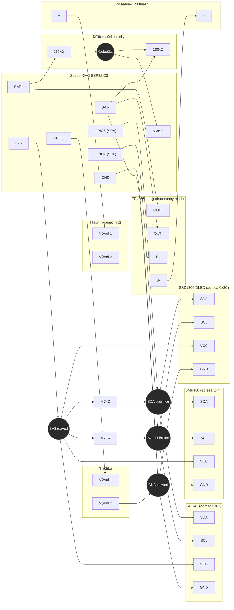

# Zapojení

## GPIO pinout (Seeed XIAO ESP32-C3)

| Pin | Funkce | Poznámka |
|---|---|---|
| GPIO6 | I2C SDA | Sdílená sběrnice: SCD41, BMP180, SSD1306 |
| GPIO7 | I2C SCL | Sdílená sběrnice: SCD41, BMP180, SSD1306 |
| GPIO4 | Snímání napětí baterky | Odbočka na děliči 220kΩ/100kΩ |
| GPIO3 | Vstup tlačítka OLED | Interní pull-up zapnutý, invertovaná logika |

## v2: hlavní vypínač baterie

Ve v2 přibyl **mechanický vypínač mezi baterií a TP4056 modulem** (v sérii na kladné větvi, mezi B+ baterky a B+ vstupem TP4056). Je to čistě hardwarová záležitost - úplně odpojí napájení celého zařízení (stejný efekt jako vytažení baterky), firmware o něm nijak neví a nepotřebuje s ním nic dělat. Slouží k tomu, aby zařízení mohlo ležet delší dobu úplně bez odběru (žádný "vampire drain" ani při zapnutém hlubokém spánku), např. při skladování.

I2C sběrnice běží na 100kHz. Interní pull-upy ESP jsou vypnuté (`sda_pullup_enabled: false`, `scl_pullup_enabled: false`), takže sběrnice běží čistě na externích 4.7kΩ pull-up rezistorech na SDA i SCL.

## Dělič napětí baterky

```
BAT+ (XIAO) ──[220kΩ]──┬──[100kΩ]── BAT- (XIAO) / GND
                        │
                      GPIO4
```

Dělič je zapojený na **BAT+/BAT- piny XIAO desky**, tedy AŽ ZA TP4056 modulem (za OUT+/OUT-), ne přímo na svorky baterky (B+/B-). Prakticky to znamená, že dělič (a stejně tak GND celého XIAO) sedí na té straně ochranného obvodu TP4056 (DW01A + FS8205A), která se při zásahu ochrany (např. hluboké vybití) odpojí od baterky.

Za normálního provozu (mimo zásah ochrany) je to bezvýznamné: ochranný FET má v sepnutém stavu odpor jen v řádu desítek miliohmů, takže úbytek napětí na něm je při běžném odběru zařízení zanedbatelný (jednotky mV) vůči tomu, co se měří (napětí baterky v řádu voltů, změny při nabíjení v řádu desítek až stovek mV). Detekce nabíjení z IR poklesu (viz níže) funguje spolehlivě i takhle, protože nabíjecí proud protéká přímo vnitřním odporem článku, ne přes tuhle větev.

Výjimka nastává při zásahu ochrany: pokud DW01A vyhodnotí hluboké vybití a FS8205A rozpojí OUT-/B-, ztratí celé XIAO (včetně GND, děliče i napájení samotného ESP32) najednou referenci vůči skutečné záporné svorce baterky - zařízení se odpojí od napájení a spadne, dělič se stane plovoucím uzlem. To bylo empiricky pozorováno při vybití pod ~2.5V (viz README, sekce Baterie).

- Poměr děliče: (220k + 100k) / 100k = 3.2
- Firmware udělá 30 rychlých čtení `analogReadMilliVolts()` na GPIO4, zprůměruje je a pak vynásobí 3.2, aby dopočítal napětí baterky
- Aktuální přesnost kalibrace viz [README.md, Known Issues](README.md#known-issues)

## Kompletní schéma zapojení

Každý jednotlivý vodič, vedený přes sdílené bus/rail uzly, aby se čáry nezamotávaly:



Poznámky ke schématu:
- `SDA sběrnice`, `SCL sběrnice`, `3V3 rozvod` a `GND rozvod` nejsou fyzické součástky, reprezentují sdílené vodiče, aby schéma nemuselo mít samostatnou křížící se čáru z XIAO ke každýmu jednotlivýmu pinu zařízení.
- SDA a SCL vedou z XIAO každá jedním vodičem, který se rozvětví ke všem třem I2C zařízením, plus pull-up rezistor na 3V3 na každé lince. Je tam jeden 4.7kΩ na SDA a jeden na SCL celkem, ne jeden na senzor.
- Všechny tři I2C zařízení sdílí stejný 3V3 a GND rozvod z XIAO.
- Tlačítko má jeden vývod na GPIO3 a druhý na GND. Interní pull-up na GPIO3 je zapnutý ve firmware a signál je invertovaný, takže pin čte vysokou hodnotu v klidu a nízkou při zmáčknutí.
- Kladný pól baterky jde přes hlavní vypínač (v2) do B+ TP4056 modulu, záporný pól jde do B- přímo. TP4056 OUT+/OUT- jde na BAT+/BAT- na XIAO, takže nabíjení řeší TP4056 modul, ne přímo XIAO deska.
- **Dělič napětí (220kΩ/100kΩ) je zapojený na BAT+/BAT- piny XIAO desky, ne přímo na B+/B- baterky.** Horní konec 220kΩ jde na BAT+, spodní konec 100kΩ jde na BAT- (stejný uzel jako GND rozvod celého XIAO). To znamená, že dělič (a GND) sedí za ochranným obvodem TP4056 (mezi B- a OUT- typicky sedí ochranný FET) - viz vysvětlení a důsledky výš v sekci "Dělič napětí baterky".
- Odbočka děliče mezi rezistory 220kΩ a 100kΩ je jediné místo připojené na GPIO4.
